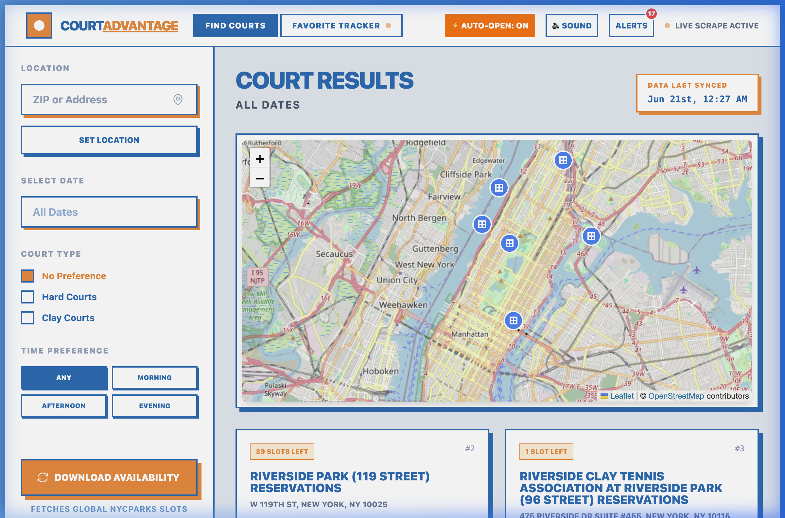
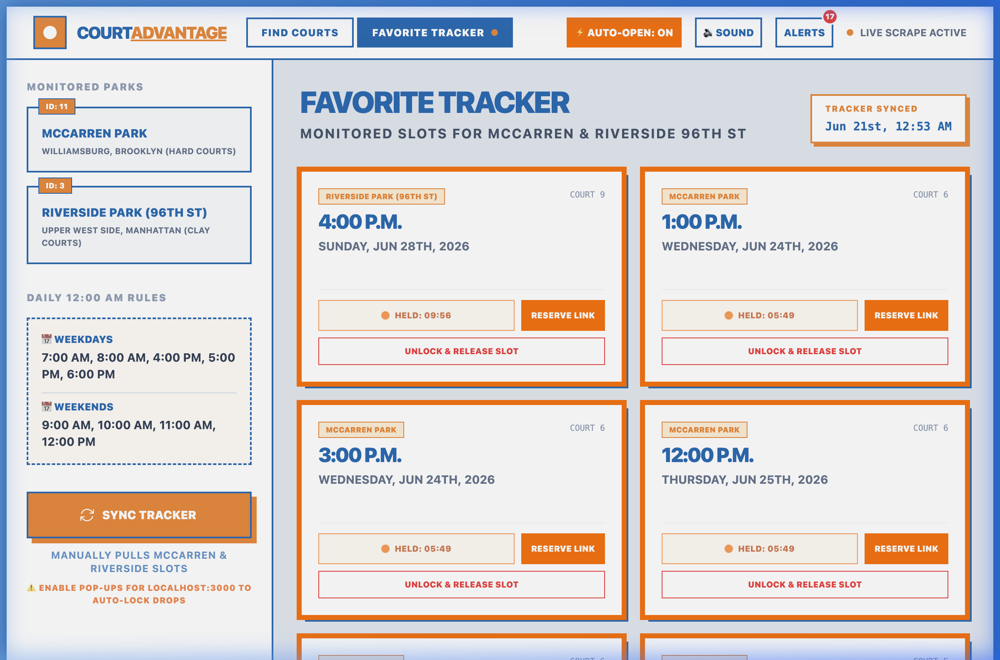
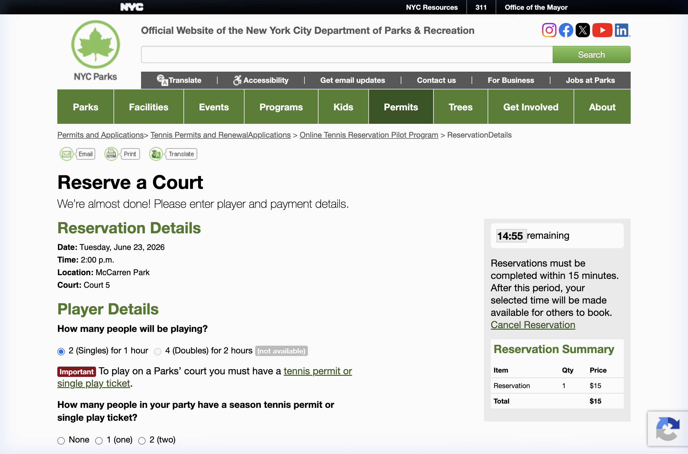

# 🎾 CourtAdvantage

CourtAdvantage is a premium, high-performance real-time tennis reservation assistant and slot-locking system for NYC Parks. It is designed to solve the problem of highly competitive court booking in NYC (such as McCarren Park and Riverside Park) by automatically scanning availability, notifying the user, and immediately placing a session hold on targeted court drops.

---

## ⚡ Main Features

* **Interactive Court Finder**: Map-based search powered by Leaflet. Includes distance calculations from your local address or ZIP centroid, along with court type filters (Hard/Clay) and time preference queries.
* **Midnight Slot-Holding Engine**: Runs a high-frequency (5s interval) check during the critical midnight drop window (12:00 AM - 12:05 AM NY time).
* **Automatic Tab Holds (⚡ Auto-Open)**: Automatically launches direct reservation checkout links in your browser to place a 15-minute database hold under your session, locking out others instantly.
* **Firestore Session Manager**: Tracks locks and countdowns globally across active instances.
* **Audio & Desktop Alerts**: Triggers native desktop notifications and premium synthesizer audio chimes the instant a target court becomes available.
* **Cloudflare / Cloudfront Bypass**: Powered by `cloudscraper` to bypass strict NYC Parks firewalls and anti-bot challenges.

---

## 📸 App Screenshots

### Find Courts Dashboard
*Search and filter available tennis courts across New York City in real time.*


### Favorite Tracker & Slot-Locks
*Monitor McCarren Park and Riverside Park (96th St) with active 15-minute countdown session holds.*


### Programmatic NYC Parks Reservation Hold
*Direct checkout landing page launched automatically under your user session, securing your court booking.*


---

## 🛠️ Tech Stack

* **Frontend**: React 19, Vite, TypeScript, Tailwind CSS, Leaflet Maps
* **Backend**: Express, Node.js, TypeScript (run via `tsx`)
* **Scraper**: Cheerio, Cloudscraper (anti-bot bypass engine)
* **Database**: Cloud Firestore

---

## 🚀 Setup & Execution

### Prerequisites
* Node.js (v18+)
* Firebase project (with Firestore enabled)

### Local Development
1. Clone this repository.
2. Install dependencies:
   ```bash
   npm install
   ```
3. Set your configuration keys inside [firebase-applet-config.json](firebase-applet-config.json) and configure your [.env](.env) file.
4. Launch the local development server:
   ```bash
   npm run dev
   ```
5. Open [http://localhost:3000](http://localhost:3000) in your web browser.

---

## 👤 Author & Owner

* **Yogendra Rao** — [LinkedIn](https://www.linkedin.com/in/dyogendrarao/)